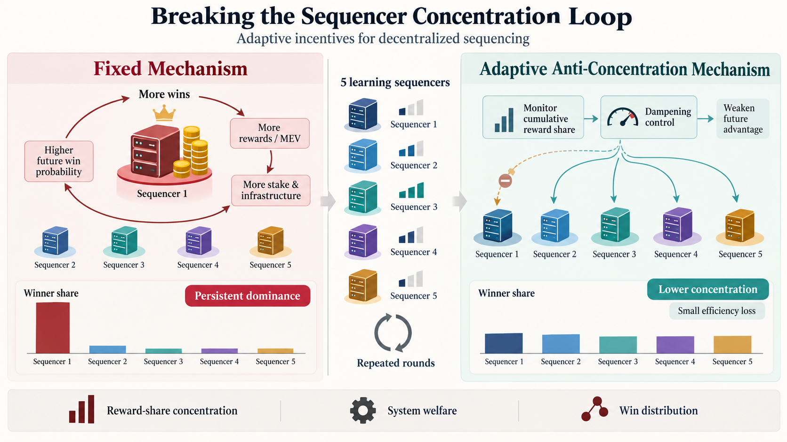

# Adaptive Sequencer Selection

[](https://huggingface.co/spaces/asdfxsasd/Sequencer_Selection_Mechanism_Design)
[](https://colab.research.google.com/drive/140wnvKP6uoW_TY1fXSKdyZol7e7CtHf-)

An interdisciplinary research prototype for testing whether an adaptive sequencer-selection or reward rule can reduce long-run concentration of blockchain sequencing power while preserving most system efficiency.



## Research question

Decentralized sequencer systems may re-centralize over time. Early winners earn more fees and maximal extractable value (MEV), which can be reinvested in stake and infrastructure and may raise their probability of winning future transaction-ordering rights.

This project asks:

> Can an adaptive sequencer-selection or reward rule reduce persistent concentration while preserving most system welfare?

Five self-interested sequencers repeatedly choose low, medium, or aggressive participation. The project compares:

- **Fixed mechanism:** selection probabilities depend on current competitive scores.
- **Adaptive anti-concentration mechanism:** an agent's effective score is dampened when its cumulative reward share exceeds a tolerance threshold.

The main outcomes are reward-share concentration, total system welfare, sequencing-win shares, and terminal stage-game regret.

## Try the project

### Hugging Face interactive demo

Open the live client-side simulation:

**[Sequencer Selection Mechanism Design on Hugging Face](https://huggingface.co/spaces/asdfxsasd/Sequencer_Selection_Mechanism_Design)**

The Space is intended for quick exploration. It lets users compare fixed and adaptive rules in a browser and inspect how concentration and welfare change. No API key or server-side model is required. See [docs/HUGGING_FACE.md](docs/HUGGING_FACE.md) for a guided walkthrough and interpretation notes.

### Google Colab notebook

The notebook provides the complete analytical and computational workflow:

**[Open the notebook in Google Colab](https://colab.research.google.com/drive/140wnvKP6uoW_TY1fXSKdyZol7e7CtHf-)**

This link opens the project's shared Colab notebook directly from Google Drive. The repository also includes source and executed notebook copies for versioned archival and reproducibility.

The notebook includes:

1. model primitives and the adaptive damping rule;
2. a finite normal-form benchmark;
3. a PyGambit extensive-form representation;
4. a two-period continuation-incentive benchmark;
5. a five-agent independent Q-learning simulation;
6. reproducibility and mechanism-equivalence checks;
7. paired, multi-seed fixed-versus-adaptive evaluation;
8. an interactive parameter laboratory.

See [docs/COLAB.md](docs/COLAB.md) for usage instructions and caveats.

## Repository structure

```text
.
├── assets/
│   └── sequencer_teaser_figure.png
├── docs/
│   ├── COLAB.md
│   └── HUGGING_FACE.md
├── notebooks/
│   ├── Adaptive_Sequencer_Selection.ipynb
│   └── Adaptive_Sequencer_Selection.executed.ipynb
├── paper/
│   ├── adaptive_sequencer_selection_proposal.pdf
│   └── overleaf/
├── scripts/
│   └── build_sequencer_notebook.py
├── requirements.txt
└── README.md
```

## Run locally

Python 3.10 or newer is recommended.

```bash
python -m venv .venv
source .venv/bin/activate
python -m pip install -r requirements.txt
jupyter notebook notebooks/Adaptive_Sequencer_Selection.ipynb
```

`pygambit` availability can depend on the operating system. Google Colab is the simplest supported environment when local installation is inconvenient.

## Model summary

Sequencer \(i\) has an effective competitive score

```text
z_i,t = productivity_i × capacity_i,t^gamma × participation_intensity_i,t.
```

The fixed mechanism normalizes these scores into selection probabilities. The adaptive mechanism multiplies the score by a damping term when cumulative reward share exceeds a threshold. Setting the anti-concentration strength to zero must reproduce the fixed mechanism exactly under the same seed; the notebook checks this property.

## Interpretation and limitations

- Simulation output is synthetic evidence about the specified model, not evidence about deployed blockchain systems or human operators.
- Independent Q-learning can converge to stable patterns, but convergence is not proof of Nash or subgame-perfect equilibrium.
- Lower concentration is not automatically better if achieved through a large welfare loss; both objectives must be reported.
- Results should be checked across paired random seeds and sensitivity settings rather than inferred from a single run.

## Proposal

The finished proposal is available at [paper/adaptive_sequencer_selection_proposal.pdf](paper/adaptive_sequencer_selection_proposal.pdf). Editable LaTeX/Overleaf sources are in [paper/overleaf](paper/overleaf).

## Academic context

This project connects three perspectives:

- **Economics:** incentive design and the decentralization-efficiency trade-off.
- **Computer science:** multi-agent learning, simulation, and reproducibility checks.
- **Behavioral science:** adaptive choice based on reward histories.

The practical motivation is to help blockchain firms and public institutions reason about accountable decentralized infrastructure without assuming that strategic behavior remains static.

## Publication checklist

- Verify that the shared Colab notebook remains accessible to the intended audience.
- Verify that the Hugging Face Space is running and public.
- Choose and add a software license before inviting reuse.
- Review the author and course metadata in the proposal before submission.
